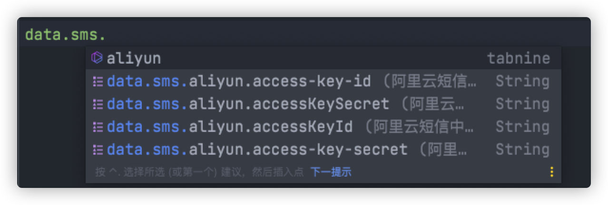

# data-sms-spring-boot-starter

最新版本 [](https://jitpack.io/#datachina/data-sms-spring-boot-starter)

支持的SDK ： 
- [x] 阿里云SDK
- [x] 腾讯云SDK
- [ ] 待定

---

## 基本介绍

1. 为什么要有这个项目？

我们的项目基本都有发短信的需求，比如短信验证码登陆、发送告警短信、发送广告推送。我们每次都要引入项目，经过一番配置才能使用。
我将常见的短信提供方做了简单集成，只需简单配置即可使用第三方的短信功能。

2. 为什么使用这个starter？

使用这个starter只需要在短信服务商处创好应用。经过简单配置即可使用短信功能。对于独特需求自己也可以使用短信方sdk提供的能力。

3. 如何使用？

引入依赖，简单配置，注入短信服务商的client或utils即可使用最基本的短信功能。

复杂功能，则可以参考服务商sdk文档实现。
4. 特点

同时提供多种方式调用接口

- 直接调接口,不需要返回值
- 直接调接口,需要返回值
- 直接调接口,返回值通过`listener`返回

5. 欢迎大家提出建议和意见

---

## 安装

### 1. 在pom.xml中加入jitpack的仓库

#### maven
```xml
<repositories>
    <repository>
        <id>jitpack.io</id>
        <url>https://jitpack.io</url>
    </repository>
</repositories>
```
#### gradle
```gradle
allprojects {
    repositories {
        maven { url 'https://jitpack.io' }
    }
}
```

> **注意:** 如果导入不了依赖,请检查自己的maven代理仓库(比如阿里云仓库)的mirrorOf标签的值是否为*
>
> 请将其改为`<mirrorOf>*,!jitpack.io</mirrorOf>`即可

### 2. 添加依赖(查看徽标确定最新版)

#### maven
```xml
<dependency>
    <groupId>com.github.datachina</groupId>
    <artifactId>data-sms-spring-boot-starter</artifactId>
    <version>最新版</version>
</dependency>
```

#### gradle
```gradle
implementation 'com.github.datachina:data-sms-spring-boot-starter:最新版'
```

---

## 快速上手

### 阿里云短信

1. 配置短信中心提供的`accessKeyId`和`accessKeySecret`。

提供配置提示功能



2. 注入`AliyunSmsUtils`。便可使用最基本的短信功能。

**扩展功能:** 注入 `AliyunSmsClient`, 便可使用阿里云短信SDK提供的全部功能。免除`Client`的创建。

### 腾讯云短信

1. 配置短信中心提供的`sdkAppId`及用户`secretId`和`secretKey`。

> 如何获取`secretId`和`secretKey`
> 
> 1. 登陆腾讯云管理中心控制台
> 
> 2. 前往 [云 API 密钥](https://console.cloud.tencent.com/cam/capi) 的控制台页面。
> 
> 3. 在云 API 密钥页面，单击新建密钥即可以创建一对密钥。
> 
> **SecretId:** 用于标识 API 调用者身份，可以简单类比为用户名。
> 
> **SecretKey:** 用于验证 API 调用者的身份，可以简单类比为密码。

2. 注入`TencentSmsUtils`。便可使用最基本的短信功能。

**扩展功能:** 注入 `TencentSmsClient`, 便可使用阿里云短信SDK提供的全部功能。免除`Client`的创建。

---

## 最佳实践(自行替换签名等内容)

### 阿里云短信demo

```java
package com.example.demo.controller;

import com.aliyun.dysmsapi20170525.models.SendSmsRequest;
import com.aliyun.dysmsapi20170525.models.SendSmsResponse;
import com.data.sms.model.AliyunSmsClient;
import com.data.sms.util.AliyunSmsUtils;
import org.springframework.web.bind.annotation.RequestMapping;
import org.springframework.web.bind.annotation.RestController;

import javax.annotation.Resource;

/**
 * 阿里云短信测试
 * @author jidaojiuyou
 */
@RestController
@RequestMapping("/ali")
public class AliTestController {

    /**
     * 注入阿里云短信工具
     */
    @Resource
    private AliyunSmsUtils aliyunSmsUtils;
    /**
     * 注入阿里云短信客户端
     */
    @Resource
    private AliyunSmsClient aliyunSmsClient;

    /**
     * 发送短信,无返回值,无回调
     *
     * @param phone    电话号码
     * @param content  内容,json格式。一般为模板替换字段。如{@code {"code":123456} }
     */
    @RequestMapping("/sendSms1")
    public void sendSms1(String phone, String content) {
        try {
            aliyunSmsUtils.sendSms(phone, "阿里云", "SMS_xxx", content);
        } catch (Exception e) {
            e.printStackTrace();
        }
    }

    /**
     * 发送短信,无返回值,有回调
     *
     * @param phone    电话号码
     * @param content  内容,json格式。一般为模板替换字段。如{@code {"code":123456} }
     */
    @RequestMapping("/sendSms2")
    public void sendSms2(String phone, String content) {
        try {
            aliyunSmsUtils.sendSms(phone, "阿里云", "SMS_xxx", content, s -> System.out.println(s.body.message));
        } catch (Exception e) {
            e.printStackTrace();
        }
    }

    /**
     * 发送短信,有返回值,无回调
     *
     * @param phone    电话号码
     * @param content  内容,json格式。一般为模板替换字段。如{@code {"code":123456} }
     */
    @RequestMapping("/sendSms3")
    public SendSmsResponse sendSms3(String phone, String content) {
        try {
            return aliyunSmsUtils.sendSms(phone, "阿里云", "SMS_xxx", content);
        } catch (Exception e) {
            e.printStackTrace();
        }
        return null;
    }


    /**
     * 使用client发短信
     *
     * @param phone    电话号码
     * @param content  内容,json格式。一般为模板替换字段。如{@code {"code":123456} }
     */
    @RequestMapping("/sendSms4")
    public void sendSms4(String phone, String content) {
        try {
            SendSmsRequest sendSmsRequest = new SendSmsRequest()
                    .setPhoneNumbers(phone)
                    .setSignName("阿里云")
                    .setTemplateCode("SMS_xxx")
                    .setTemplateParam(content);
            SendSmsResponse sendSmsResponse = aliyunSmsClient.sendSms(sendSmsRequest);
            System.out.println(sendSmsResponse.body.message);
        } catch (Exception e) {
            e.printStackTrace();
        }
    }
}
```

### 腾讯云短信demo

```java
package com.example.demo.controller;

import com.data.sms.model.TencentSmsClient;
import com.data.sms.properties.TencentSmsProperties;
import com.data.sms.util.TencentSmsUtils;
import com.tencentcloudapi.sms.v20210111.models.*;
import org.springframework.web.bind.annotation.RequestMapping;
import org.springframework.web.bind.annotation.RestController;

import javax.annotation.Resource;

/**
 * 腾讯云短信测试
 *
 * @author jidaojiuyou
 */
@RestController
@RequestMapping("/tencent")
public class TencentTestController {

    @Resource
    private TencentSmsClient tencentSmsClient;
    @Resource
    private TencentSmsUtils tencentSmsUtils;
    @Resource
    private TencentSmsProperties properties;

    /**
     * 发送短信,无返回值,无回调
     *
     * @param phone   电话号码
     * @param content 内容
     */
    @RequestMapping("/sendSms1")
    public void sendSms1(String phone, String content) {
        try {
            tencentSmsUtils.sendSms(phone, "腾讯云", "xxx", content);
        } catch (Exception e) {
            e.printStackTrace();
        }
    }

    /**
     * 发送短信,无返回值,有回调
     *
     * @param phone   电话号码
     * @param content 内容
     */
    @RequestMapping("/sendSms2")
    public void sendSms2(String phone, String content) {
        try {
            tencentSmsUtils.sendSms(phone, "腾讯云", "xxx", content, System.out::println);
        } catch (Exception e) {
            e.printStackTrace();
        }
    }

    /**
     * 发送短信,有返回值,无回调
     *
     * @param phone   电话号码
     * @param content 内容
     */
    @RequestMapping("/sendSms3")
    public SendSmsResponse sendSms3(String phone, String content) {
        try {
            return tencentSmsUtils.sendSms(phone, "腾讯云", "xxx", content);
        } catch (Exception e) {
            e.printStackTrace();
        }
        return null;
    }

    /**
     * 使用client发短信
     *
     * @param phone   电话号码
     * @param content 内容
     */
    @RequestMapping("/sendSms4")
    public void sendSms4(String phone, String content) {
        // 创建请求对象
        SendSmsRequest req = new SendSmsRequest();
        // 处理号码
        phone = "+86" + phone;
        String[] phoneNumberSet = {phone};
        // 设置号码
        req.setPhoneNumberSet(phoneNumberSet);
        // 短信应用ID
        req.setSmsSdkAppId(properties.getSdkAppId());
        // 短信签名内容
        req.setSignName("腾讯云");
        // 模板Id
        req.setTemplateId("xxx");
        // 处理模板参数
        String[] templateParamSet = {content};
        // 设置模板参数
        req.setTemplateParamSet(templateParamSet);
        try {
            SendSmsResponse sendSmsResponse = tencentSmsClient.SendSms(req);
            System.out.println(sendSmsResponse.getRequestId());
        } catch (Exception e) {
            e.printStackTrace();
        }
    }
}
```