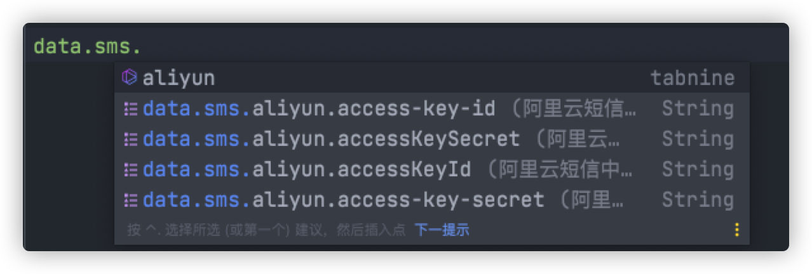

# data-sms-spring-boot-starter

最新版本 [](https://jitpack.io/#com.gitee.jidaojiuyou/data-sms-spring-boot-starter)

支持的SDK ： 
- [x] 阿里云SDK
- [ ] 待定


## 阿里云短信部分
采用自动配置方式注入`AliyunSmsClient`。并提供了最基本得发短信和查短信的功能。

同时提供多种方式调用接口

- 直接调接口,不需要返回值
- 直接调接口,需要返回值
- 直接调接口,返回值通过`listener`返回

扩展功能,可以注入 `AliyunSmsClient`,来使用阿里云短信SDK提供的全部功能。免除`Client`的创建。

提供配置提示功能



### 使用方法

1. 在pom.xml中加入jitpack的仓库

#### maven 
```xml
<repositories>
    <repository>
        <id>jitpack.io</id>
        <url>https://jitpack.io</url>
    </repository>
</repositories>
```
#### gradle

```gradle
allprojects {
    repositories {
        maven { url 'https://jitpack.io' }
    }
}
```

2. 添加依赖(查看徽标确定最新版)

```xml
<dependency>
    <groupId>com.gitee.jidaojiuyou</groupId>
    <artifactId>data-sms-spring-boot-starter</artifactId>
    <version>最新版</version>
</dependency>
```

```gradle
implementation 'com.gitee.jidaojiuyou:data-sms-spring-boot-starter:最新版'
```

3. 注入`AliyunSmsUtils`或`AliyunSmsClient`使用

--- 

> 异常情况: 如果导入不了依赖,请检查自己的maven代理仓库(比如阿里云仓库)的mirrorOf标签的值是否为*
> 
> 请将其改为`<mirrorOf>*,!jitpack.io</mirrorOf>`即可

### 例子

```java
@RestController
public class TestController {

    /**
     * 注入阿里云短信工具
     */
    @Resource
    private AliyunSmsUtils aliyunSmsUtils;
    /**
     * 注入阿里云短信客户端
     */
    @Resource
    private AliyunSmsClient client;

    /**
     * 发送短信验证码,无返回值,无回调
     *
     * @param phone 电话号码
     * @param code  验证码
     */
    @RequestMapping("/sendSms1")
    public void sendCode1(String phone, String code) {
        try {
            // TODO 请自行替换signName和templateCode
            aliyunSmsUtils.sendSms(phone, "***", "SMS_******", "{\"code\":\"" + code + "\"}");
        } catch (Exception e) {
            e.printStackTrace();
        }
    }

    /**
     * 发送短信验证码,有回调
     *
     * @param phone 电话号码
     * @param code  验证码
     */
    @RequestMapping("/sendSms2")
    public void sendCode2(String phone, String code) {
        try {
            // TODO 请自行替换signName和templateCode
            aliyunSmsUtils.sendSms(phone, "***", "SMS_******", "{\"code\":\"" + code + "\"}", s -> {
                System.out.println(s.body.message);
            });
        } catch (Exception e) {
            e.printStackTrace();
        }
    }

    /**
     * 发送短信验证码,有返回值
     *
     * @param phone 电话号码
     * @param code  验证码
     */
    @RequestMapping("/sendSms3")
    public void sendCode3(String phone, String code) {
        try {
            // TODO 请自行替换signName和templateCode
            SendSmsResponse sendSmsResponse = aliyunSmsUtils.sendSmsAndReturnResponse(phone, "***", "SMS_******", "{\"code\":\"" + code + "\"}");
            System.out.println(sendSmsResponse.body.message);
        } catch (Exception e) {
            e.printStackTrace();
        }
    }


    /**
     * 使用client发短信
     *
     * @param phone 电话号码
     * @param code  验证码
     */
    @RequestMapping("/sendSms4")
    public void sendCode4(String phone, String code) {
        try {
            // TODO 请自行替换signName和templateCode
            SendSmsRequest sendSmsRequest = new SendSmsRequest()
                    .setPhoneNumbers(phone)
                    .setSignName("***")
                    .setTemplateCode("SMS_******")
                    .setTemplateParam("{\"code\":\"" + code + "\"}");
            SendSmsResponse sendSmsResponse = client.sendSms(sendSmsRequest);
            System.out.println(sendSmsResponse.body.message);
        } catch (Exception e) {
            e.printStackTrace();
        }
    }

    /**
     * 查询记录
     *
     * @param phone    电话号码
     * @param data     查询日期
     * @param pageSize 页数
     * @param pageNum  页码
     * @param bizId    发短信的流水号
     * @return 查询的结果
     */
    @RequestMapping("/query")
    public QuerySendDetailsResponse query(String phone, String data, String pageSize, String pageNum, String bizId) {
        try {
            return aliyunSmsUtils.querySendHistory(phone, data, Long.valueOf(pageSize), Long.valueOf(pageNum), bizId);
        } catch (Exception e) {
            e.printStackTrace();
        }
        return null;
    }
}
```